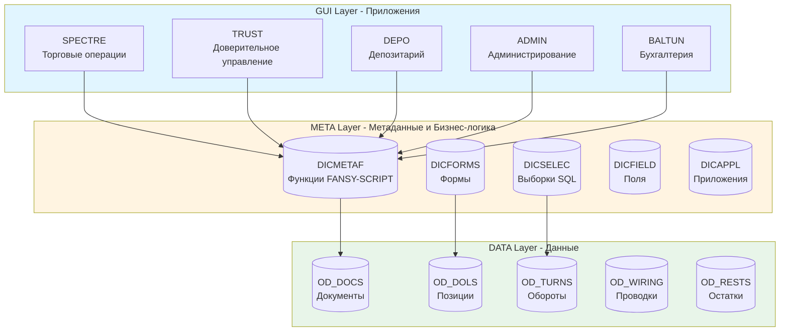
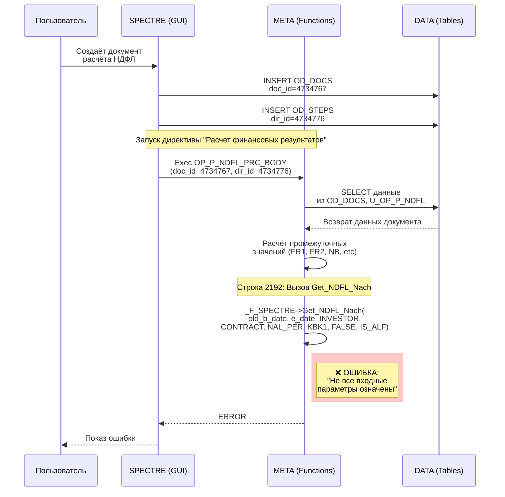
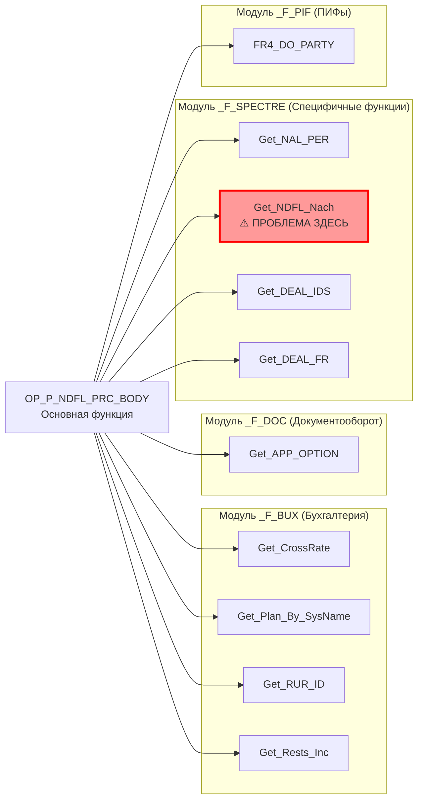
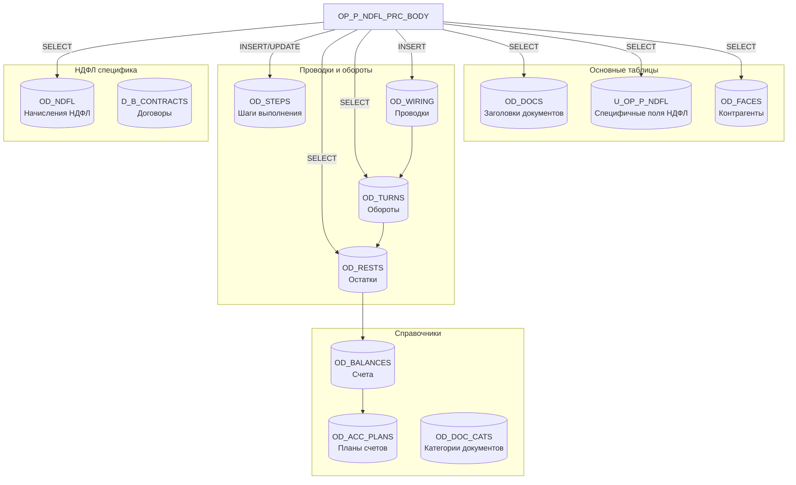
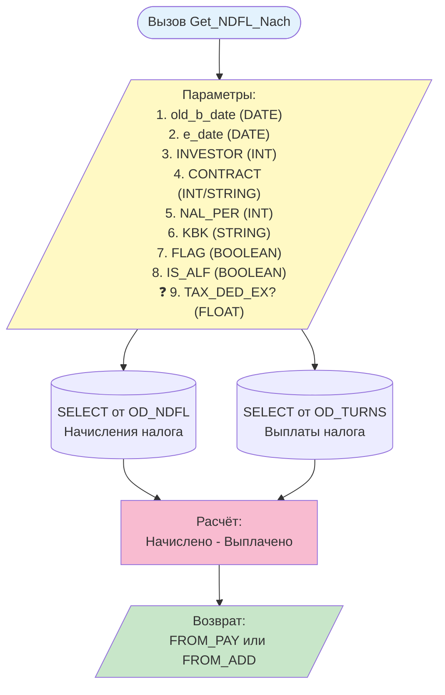
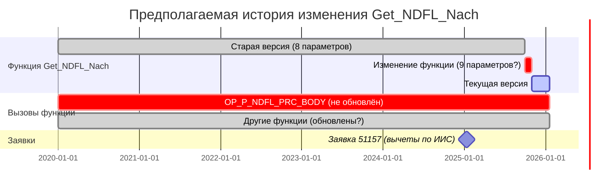
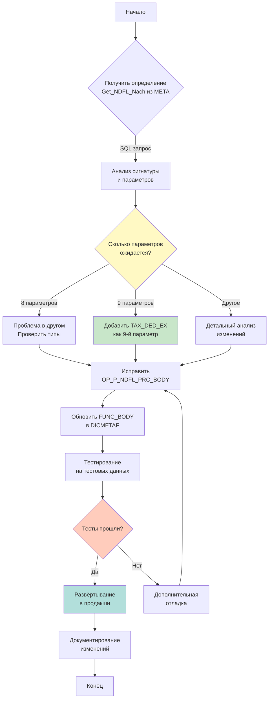
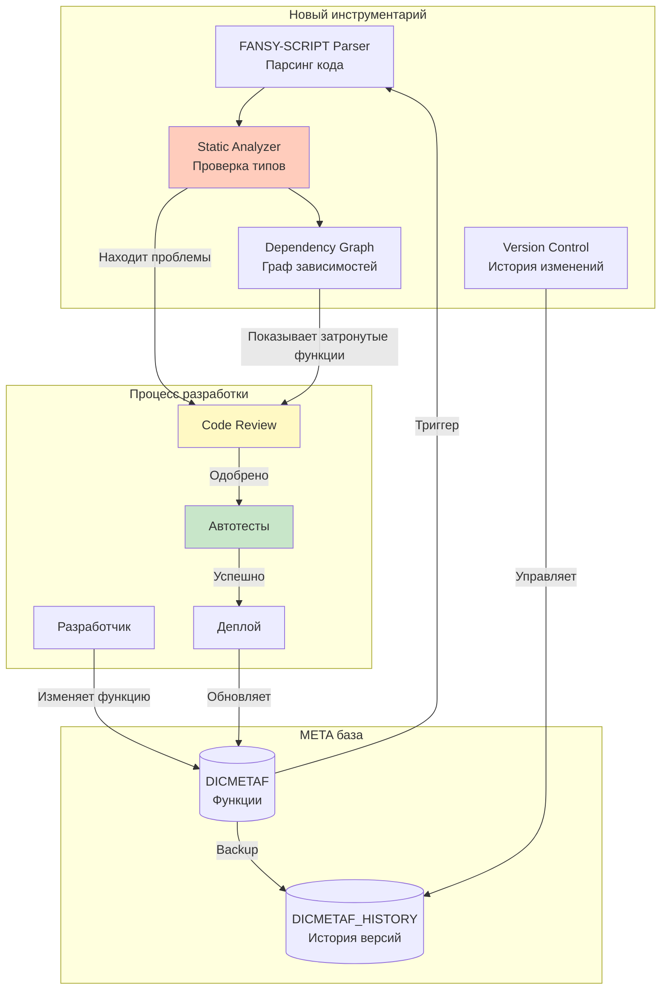

# Визуализация архитектуры и потоков данных Fansy

## 1. Общая трёхслойная архитектура

## 2. Поток выполнения документа с ошибкой

## 3. Зависимости функции OP_P_NDFL_PRC_BODY

## 4. Таблицы данных, задействованные в расчёте

## 5. Детальный поток данных для Get_NDFL_Nach

## 6. Временная линия изменений (гипотеза)

## 7. План устранения проблемы

## 8. Архитектура решения для предотвращения проблем

