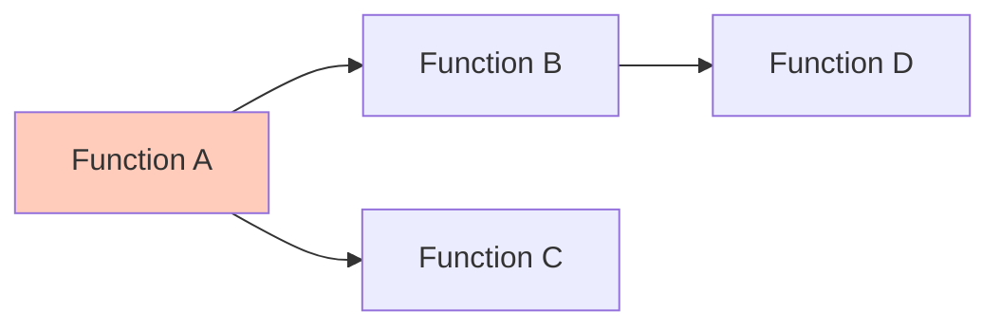

# Практическое руководство по работе с legacy-системой Fansy

## Содержание
1. [Быстрый старт](#быстрый-старт)
2. [Анализ ошибки OP_P_NDFL_PRC_BODY](#анализ-ошибки)
3. [Работа с метаданными](#работа-с-метаданными)
4. [Использование инструментов](#использование-инструментов)
5. [Лучшие практики](#лучшие-практики)

---

## Быстрый старт

### Что у нас есть

**Документация:**
- `fansy_analysis.md` - полный анализ системы и проблемы
- `fansy_diagrams.md` - визуализация архитектуры (Mermaid)
- Это руководство

**Инструменты:**
- `fansy_analyzer.py` - Python-анализатор FANSY-SCRIPT кода
- `fansy_queries.sql` - SQL-запросы для работы с метаданными

**Исходные данные:**
- `PROGRAM.pdf` - документация по FANSY-SCRIPT
- `meta_base_structure_UTF-8.txt` - DDL структуры META базы
- `OP_P_NDFL_PRC_BODY.txt` - проблемная функция

### Первые шаги

1. **Понять архитектуру** → читайте `fansy_analysis.md`, раздел 1
2. **Изучить проблему** → читайте `fansy_analysis.md`, раздел 2
3. **Визуализировать** → откройте `fansy_diagrams.md` в редакторе с поддержкой Mermaid
4. **Запустить анализ** → `python3 fansy_analyzer.py`

---

## Анализ ошибки OP_P_NDFL_PRC_BODY {#анализ-ошибки}

### Что мы знаем

**Ошибка:** "Не все входные параметры означены"  
**Место:** Строка 2192 в функции `OP_P_NDFL_PRC_BODY`  
**Вызов:**
```fansy-script
FROM_PAY:=_F_SPECTRE->Get_NDFL_Nach(
    old_b_date, 
    iif((NDFL_TYPE>=2) and (Date(E_DATE)=Date(D_DATE)), d_date, e_date),
    INVESTOR, 
    CONTRACT, 
    NAL_PER, 
    _F_SPECTRE.Get_NAL_PER.KBK1, 
    FALSE, 
    IS_ALF
);
```

**Количество параметров:** 8

### Пошаговый план устранения

#### Шаг 1: Получить актуальную сигнатуру функции

Выполните SQL-запрос из `fansy_queries.sql` (запрос #1):

```sql
SELECT 
    M.FUNC_NAME,
    M.FUNC_HEAD,
    M.FUNC_BODY
FROM 
    META.DICMETAF M
    JOIN META.DICAPPL A ON A.NUM = M.APP_NUM
WHERE 
    M.FUNC_NAME = 'Get_NDFL_Nach'
    AND A.APPL_ID = '_F_SPECTRE'
ORDER BY 
    M.SYS_DATE DESC;
```

**Результат покажет:**
- Заголовок функции с типами параметров
- Тело функции для понимания логики
- Дату последнего изменения

#### Шаг 2: Сравнить параметры

Создайте таблицу сравнения:

| № | Передано в вызове | Ожидается (из FUNC_HEAD) | Совпадение |
|---|-------------------|--------------------------|------------|
| 1 | old_b_date        | ?                        | ?          |
| 2 | e_date (условно)  | ?                        | ?          |
| 3 | INVESTOR          | ?                        | ?          |
| 4 | CONTRACT          | ?                        | ?          |
| 5 | NAL_PER           | ?                        | ?          |
| 6 | KBK1              | ?                        | ?          |
| 7 | FALSE             | ?                        | ?          |
| 8 | IS_ALF            | ?                        | ?          |
| 9 | **???**           | **TAX_DED_EX?**          | **❌**     |

#### Шаг 3: Проверить контекст

Обратите внимание на строки перед вызовом (2184):

```fansy-script
/* учитываем вычеты по ИИС EAN 11.01.2025 заявка 51157*/
TAX_DED_EX:=Extract('Данные',
    [select f_round(sum(N.SUMMA), 2) 
     from OD_NDFL N 
     where N.R_TYPE=-1 and N.CODE=619 
       and N.FACE=:FACE 
       and N.R_DATE>=:B and N.R_DATE<:E 
       and N.LINK_CODE=0], 
    INVESTOR, OLD_B_DATE, E_DATE);
```

**Гипотеза:** Переменная `TAX_DED_EX` рассчитывается, но не передаётся в `Get_NDFL_Nach`

#### Шаг 4: Исправить код

Если гипотеза подтвердилась, измените вызов:

```fansy-script
FROM_PAY:=_F_SPECTRE->Get_NDFL_Nach(
    old_b_date, 
    iif((NDFL_TYPE>=2) and (Date(E_DATE)=Date(D_DATE)), d_date, e_date),
    INVESTOR, 
    CONTRACT, 
    NAL_PER, 
    _F_SPECTRE.Get_NAL_PER.KBK1, 
    FALSE, 
    IS_ALF,
    TAX_DED_EX  // <-- ДОБАВЛЕНО
);
```

То же для `FROM_ADD` (строка 2193).

#### Шаг 5: Обновить метаданные

```sql
UPDATE META.DICMETAF
SET 
    FUNC_BODY = '<новое_тело_функции>',
    SYS_DATE = CURRENT_TIMESTAMP,
    SYS_USER = '<ваш_пользователь>'
WHERE 
    FUNC_NAME = 'OP_P_NDFL_PRC_BODY'
    AND APP_NUM = (SELECT NUM FROM META.DICAPPL WHERE APPL_ID = '<приложение>');
```

**⚠️ ВАЖНО:** Перед обновлением сделайте бэкап!

```sql
-- Бэкап старой версии
INSERT INTO META.DICMETAF_HISTORY (FUNC_NAME, FUNC_BODY, BACKUP_DATE, BACKUP_USER)
SELECT FUNC_NAME, FUNC_BODY, CURRENT_TIMESTAMP, USER
FROM META.DICMETAF
WHERE FUNC_NAME = 'OP_P_NDFL_PRC_BODY';
```

#### Шаг 6: Тестирование

1. **Выберите тестовый документ** (не 4734767!)
2. **Запустите директиву** через SPECTRE
3. **Проверьте результаты:**
   - Нет ошибок выполнения
   - Корректные значения FROM_PAY и FROM_ADD
   - Проводки созданы правильно

#### Шаг 7: Развёртывание

После успешного теста:
1. Задокументируйте изменение
2. Уведомите команду
3. Обновите продакшн-базу
4. Повторно запустите проблемный документ 4734767

---

## Работа с метаданными {#работа-с-метаданными}

### Структура META базы

```
META
├── DICMETAF      - Функции FANSY-SCRIPT
├── DICAPPL       - Приложения (модули)
├── DICFORMS      - Формы документов
├── DICSELEC      - SQL-выборки
├── DICFIELD      - Поля
├── DICFORAP      - Связь форм и приложений
└── DICSELFO      - Связь выборок и форм
```

### Ключевые запросы

#### Найти все функции модуля

```sql
SELECT 
    M.FUNC_NAME,
    M.FUNC_DESCR,
    LENGTH(M.FUNC_BODY) AS CODE_SIZE
FROM 
    META.DICMETAF M
    JOIN META.DICAPPL A ON A.NUM = M.APP_NUM
WHERE 
    A.APPL_ID = '_F_SPECTRE'
ORDER BY 
    M.FUNC_NAME;
```

#### Найти, где используется функция

```sql
SELECT 
    M.FUNC_NAME AS CALLER,
    A.APPL_ID AS MODULE
FROM 
    META.DICMETAF M
    JOIN META.DICAPPL A ON A.NUM = M.APP_NUM
WHERE 
    M.FUNC_BODY CONTAINING 'Get_NDFL_Nach'
ORDER BY 
    M.FUNC_NAME;
```

#### Получить полное определение функции

```sql
SELECT 
    '// ' || M.FUNC_NAME || M.FUNC_HEAD || CHR(10) ||
    M.FUNC_BODY AS FULL_CODE
FROM 
    META.DICMETAF M
WHERE 
    M.FUNC_NAME = 'Get_NDFL_Nach';
```

### Изменение функций

**Workflow:**
1. SELECT текущей версии
2. Бэкап в DICMETAF_HISTORY
3. UPDATE с новым кодом
4. Тестирование
5. Документирование

**Шаблон UPDATE:**

```sql
-- 1. Бэкап
INSERT INTO META.DICMETAF_HISTORY 
SELECT *, CURRENT_TIMESTAMP, USER 
FROM META.DICMETAF 
WHERE FUNC_NAME = '<функция>';

-- 2. Обновление
UPDATE META.DICMETAF
SET 
    FUNC_BODY = '<новый_код>',
    SYS_DATE = CURRENT_TIMESTAMP,
    SYS_USER = USER
WHERE 
    FUNC_NAME = '<функция>';

-- 3. Проверка
SELECT FUNC_NAME, SYS_DATE, SYS_USER
FROM META.DICMETAF
WHERE FUNC_NAME = '<функция>';
```

---

## Использование инструментов {#использование-инструментов}

### Python-анализатор (fansy_analyzer.py)

#### Базовое использование

```bash
python3 fansy_analyzer.py
```

Выводит:
- Информацию о функции
- Список используемых модулей
- Все вызовы функций
- Найденные вызовы Get_NDFL_Nach

#### Расширенное использование

Модифицируйте `main()` для анализа других файлов:

```python
# В конце файла fansy_analyzer.py
def analyze_custom_file(filepath: str):
    parser = FansyScriptParser()
    result = parser.analyze_file(filepath)
    
    # Ваш анализ
    print(f"Функция: {result['header'].name}")
    print(f"Вызовов: {len(result['calls'])}")
    
    # Найти все вызовы конкретной функции
    target_calls = [c for c in result['calls'] if c.name == 'Get_NDFL_Nach']
    for call in target_calls:
        print(f"Строка {call.line_number}: {call.args_count} параметров")

# Вызов
analyze_custom_file('/path/to/function.txt')
```

#### Проверка совместимости

```python
from fansy_analyzer import CompatibilityChecker, FunctionSignature, FunctionCall

# Создаём checker
checker = CompatibilityChecker()

# Регистрируем известную сигнатуру
sig = FunctionSignature(
    name='Get_NDFL_Nach',
    module='_F_SPECTRE',
    params=[
        ('b_date', 'DATE'),
        ('e_date', 'DATE'),
        ('investor', 'INT'),
        ('contract', 'STRING'),
        ('nal_per', 'INT'),
        ('kbk', 'STRING'),
        ('flag', 'BOOLEAN'),
        ('is_alf', 'BOOLEAN'),
        ('tax_ded', 'FLOAT')  # <-- 9-й параметр!
    ],
    description='Расчёт начисленного НДФЛ'
)
checker.register_signature(sig)

# Проверяем вызов
call = FunctionCall(
    name='Get_NDFL_Nach',
    module='_F_SPECTRE',
    args_count=8,  # Передано только 8!
    line_number=2192,
    line_text='FROM_PAY:=_F_SPECTRE->Get_NDFL_Nach(...)',
    args=['old_b_date', 'e_date', 'INVESTOR', 'CONTRACT', 'NAL_PER', 'KBK1', 'FALSE', 'IS_ALF']
)

issue = checker.check_call(call)
if issue:
    print(f"❌ {issue['type']}: {issue['message']}")
    # Выведет: PARAM_COUNT_MISMATCH: Ожидается 9 параметров, передано 8
```

### SQL-запросы (fansy_queries.sql)

Файл содержит 12 готовых запросов для различных сценариев.

#### Как использовать

1. **Откройте файл** в SQL-редакторе (IBExpert, FlameRobin, или другом)
2. **Подключитесь** к META базе
3. **Выберите нужный запрос** (они пронумерованы)
4. **Замените параметры** (например, `4734767` на нужный doc_id)
5. **Выполните**

#### Примеры использования

**Найти определение функции:**
```sql
-- Запрос #1 из fansy_queries.sql
SELECT M.FUNC_NAME, M.FUNC_HEAD, M.FUNC_BODY
FROM META.DICMETAF M
JOIN META.DICAPPL A ON A.NUM = M.APP_NUM
WHERE M.FUNC_NAME = 'Get_NDFL_Nach'
  AND A.APPL_ID = '_F_SPECTRE';
```

**Найти все места использования:**
```sql
-- Запрос #3 из fansy_queries.sql
SELECT M.FUNC_NAME, A.APPL_ID, M.FUNC_DESCR
FROM META.DICMETAF M
JOIN META.DICAPPL A ON A.NUM = M.APP_NUM
WHERE M.FUNC_BODY CONTAINING 'Get_NDFL_Nach'
ORDER BY M.FUNC_NAME;
```

**Посмотреть данные документа:**
```sql
-- Запрос #4 из fansy_queries.sql
SELECT D.*, DC.CAT_NAME
FROM DATA.OD_DOCS D
LEFT JOIN DATA.OD_DOC_CATS DC ON DC.ID = D.D_CAT
WHERE D.ID = 4734767;
```

### Mermaid-диаграммы (fansy_diagrams.md)

#### Просмотр

**В GitHub/GitLab:** Mermaid рендерится автоматически  
**Локально:** Используйте редактор с поддержкой Mermaid:
- VS Code + расширение "Markdown Preview Mermaid Support"
- Obsidian
- Typora
- Онлайн: https://mermaid.live/

#### Создание новых диаграмм

Шаблон для добавления функции в граф зависимостей:



---

## Лучшие практики {#лучшие-практики}

### 1. Перед изменением функции

**✅ DO:**
- Сделайте бэкап текущей версии
- Найдите все места использования
- Проверьте зависимые функции
- Задокументируйте причину изменения

**❌ DON'T:**
- Не меняйте сигнатуру без проверки всех вызовов
- Не удаляйте параметры без миграции
- Не забывайте обновлять комментарии

### 2. Контроль версий

Создайте таблицу истории (если её нет):

```sql
CREATE TABLE META.DICMETAF_HISTORY (
    ID INTEGER NOT NULL,
    FUNC_NAME VARCHAR(64),
    APP_NUM INTEGER,
    FUNC_HEAD VARCHAR(1024),
    FUNC_BODY BLOB SUB_TYPE TEXT,
    BACKUP_DATE TIMESTAMP,
    BACKUP_USER VARCHAR(64),
    CHANGE_REASON VARCHAR(1024),
    PRIMARY KEY (ID)
);

CREATE GENERATOR DICMETAF_HISTORY_ID_GEN;
```

При каждом изменении:

```sql
INSERT INTO META.DICMETAF_HISTORY (
    ID, FUNC_NAME, APP_NUM, FUNC_HEAD, FUNC_BODY, 
    BACKUP_DATE, BACKUP_USER, CHANGE_REASON
)
SELECT 
    GEN_ID(DICMETAF_HISTORY_ID_GEN, 1),
    FUNC_NAME, APP_NUM, FUNC_HEAD, FUNC_BODY,
    CURRENT_TIMESTAMP, USER, 
    'Изменение для заявки #51157 - добавлен параметр TAX_DED_EX'
FROM META.DICMETAF
WHERE FUNC_NAME = 'Get_NDFL_Nach';
```

### 3. Документирование

Для каждого изменения создавайте запись:

```markdown
## Изменение: Get_NDFL_Nach - добавлен параметр TAX_DED_EX

**Дата:** 2026-01-19  
**Автор:** <имя>  
**Заявка:** #51157  

**Причина:** Необходимость учёта налоговых вычетов по ИИС

**Изменения:**
- Добавлен параметр #9: TAX_DED_EX (FLOAT)
- Обновлена логика расчёта FROM_PAY

**Затронутые функции:**
- OP_P_NDFL_PRC_BODY (обновлено)
- OP_P_NDFL_CALC (требует обновления)

**Миграция:**
Все вызовы Get_NDFL_Nach должны передавать TAX_DED_EX как 9-й параметр.
Старые вызовы будут выдавать ошибку "Не все входные параметры означены".
```

### 4. Тестирование

**Минимальный набор тестов:**

```sql
-- Тест 1: Функция выполняется без ошибок
SELECT _F_SPECTRE.Get_NDFL_Nach(
    '2025-01-01', '2025-12-31', 
    12345, 'C-001', 2025, '182', 0, 0, 0.0
) FROM RDB$DATABASE;

-- Тест 2: Корректный результат для известных данных
-- (сравните с ручным расчётом)

-- Тест 3: Граничные случаи
-- NULL значения, пустые периоды, нулевые суммы
```

**Интеграционные тесты:**

1. Создайте тестовый документ
2. Запустите директиву
3. Проверьте:
   - OD_STEPS.STATE = 'SUCCESS'
   - OD_WIRING созданы корректно
   - OD_TURNS соответствуют ожиданиям

### 5. Отладка

**Использование breakpoint:**

```fansy-script
breakpoint;  // Выполнение остановится здесь
```

**Логирование:**

```fansy-script
// Временное логирование для отладки
_Metal_F->GL_Add('DEBUG', 'TAX_DED_EX = ' + Str(TAX_DED_EX));
```

**Пошаговое выполнение:**

1. Установите breakpoint перед проблемным местом
2. Запустите документ
3. В отладчике проверьте значения переменных
4. Продолжайте выполнение

### 6. Работа с legacy-кодом

**Принципы:**

1. **Понять, прежде чем менять**
   - Прочитайте код полностью
   - Найдите все зависимости
   - Поймите бизнес-логику

2. **Изменять постепенно**
   - Маленькие, атомарные изменения
   - Одно изменение = одна цель
   - Тестировать после каждого изменения

3. **Документировать всё**
   - Что изменили
   - Почему изменили
   - Как это влияет на систему

4. **Не бояться рефакторинга**
   - Но делать его осторожно
   - С полным покрытием тестами
   - С возможностью отката

### 7. Чеклист перед коммитом

- [ ] Код проверен на синтаксические ошибки
- [ ] Все параметры функций означены
- [ ] Сделан бэкап старой версии
- [ ] Обновлены все вызовы функции
- [ ] Пройдены юнит-тесты
- [ ] Пройдены интеграционные тесты
- [ ] Обновлена документация
- [ ] Код-ревью проведено
- [ ] Changelog обновлён

---

## Заключение

Эта система может показаться сложной, но при систематическом подходе она становится управляемой:

1. **Документируйте всё** - будущее "вы" скажет спасибо
2. **Используйте инструменты** - они экономят время
3. **Тестируйте изменения** - лучше потратить час на тесты, чем день на исправление в продакшне
4. **Работайте в команде** - две головы лучше одной

При возникновении вопросов:
1. Проверьте эту документацию
2. Изучите PROGRAM.pdf
3. Проанализируйте метаданные
4. Спросите коллег

**Удачи в работе с Fansy! 🚀**
